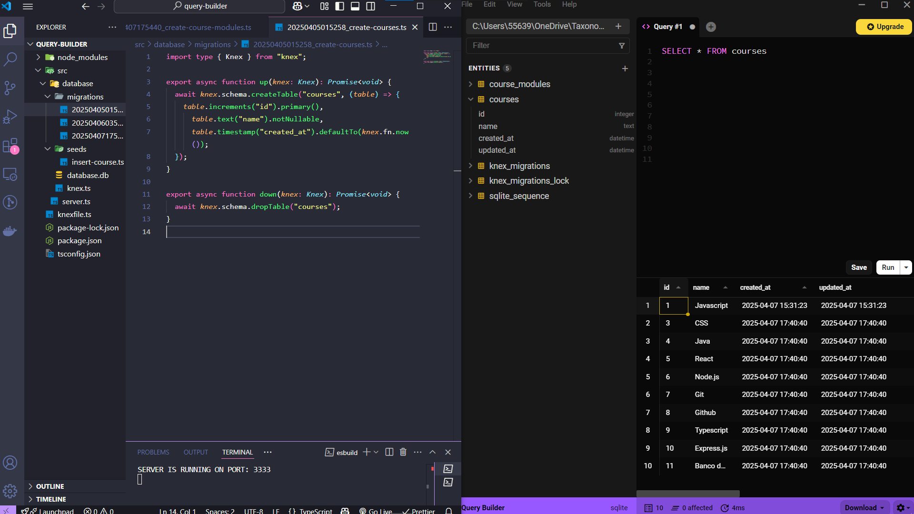

# 🧱 Query Builder com Knex.js

Projeto desenvolvido para praticar a criação de queries SQL utilizando **Knex.js** com **SQLite3** e **TypeScript**.

---

## 🖼️ Preview

> 

## ⚙️ Tecnologias utilizadas

- Node.js
- Express
- TypeScript
- Knex.js
- SQLite3
- Beekeeper Studio (visualização de dados)
- Insomnia (testes de API)

## 🛠️ O Projeto

Desenvolvi um Query Builder em TypeScript que converte métodos tipados em queries SQL, incluindo:

- ✅ Operações CRUD completas
- ✅ Seeders para dados de teste
- ✅ Relacionamentos entre tabelas

O foco é abstrair a construção de queries de forma segura, escalável e com tipagem forte, aproveitando o poder do TypeScript para evitar erros em tempo de execução.

## 🧬 Exemplo de Migration

```ts
export async function up(knex: Knex) {
  return knex.schema.createTable("courses", (table) => {
    table.uuid("id").primary();
    table.string("name").notNullable();
    table.string("description").notNullable();
  });
}

export async function down(knex: Knex) {
  return knex.schema.dropTable("courses");
}
```
